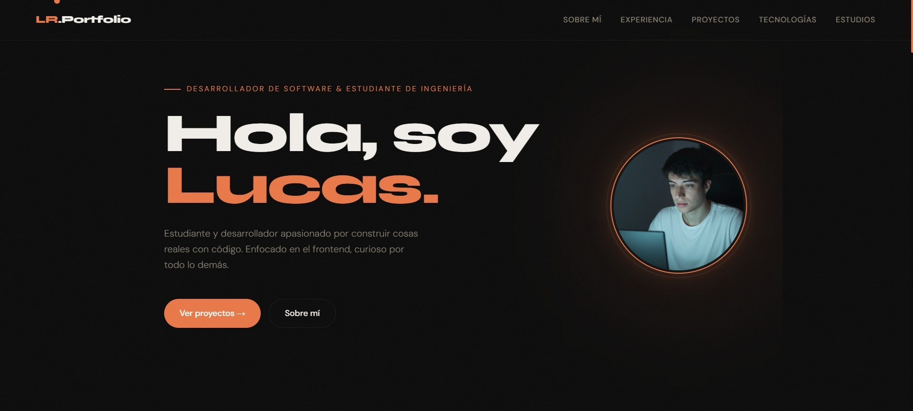

# 🚀 Portfolio — Lucas Ruiz

> Portfolio personal desarrollado con **HTML, CSS y JavaScript vanilla**. Diseñado desde cero con un estilo oscuro, moderno y minimalista.

---

## 📸 Vista previa



---

## ✨ Características

- **Diseño dark** con paleta naranja como color de acento
- **Cursor personalizado** animado con efecto hover
- **Animaciones de entrada** con Intersection Observer (scroll reveal)
- **Foto de perfil circular** con anillo animado rotatorio
- **Descarga de CV** directamente desde la página
- **Secciones completas:** Sobre mí · Experiencia · Proyectos · Tecnologías · Estudios
- **100% Responsive** — adaptado para mobile y desktop
- **Efecto grain** sutil en el fondo para textura visual
- **Scrollbar personalizada** en naranja

---

## 🛠️ Tecnologías utilizadas

| Tecnología | Uso |
|---|---|
| HTML5 | Estructura semántica |
| CSS3 | Estilos, animaciones, variables CSS |
| JavaScript (Vanilla) | Cursor, scroll reveal, interactividad |
| Google Fonts | Syne + DM Sans |
| SVG inline | Íconos sin dependencias externas |

---

## 📁 Estructura del proyecto

```
portfolio/
├── index.html          # Estructura principal
├── style.css           # Todos los estilos
└── assets/
    ├── foto_perfil.png         # Foto de perfil
    ├── proyec2.jpg             # Imagen Proyecto 1
    ├── proyecto1.jpg           # Imagen Proyecto 2
    ├── proyec3.jpg             # Imagen Proyecto 3
    ├── proyecto4.jpg           # Imagen Portfolio
    └── Lucas_Ruiz_CV_*.pdf     # CV descargable
```

---

## 🧩 Secciones

### 01 — Sobre mí
Presentación personal con tarjetas de estadísticas (años de experiencia, proyectos, etc.).

### 02 — Experiencia
Timeline con experiencia laboral/freelance, empresas, tecnologías usadas y descripción de cada rol.

### 03 — Proyectos
Grid de cards con imagen, descripción, tecnologías y links a demo / GitHub.

### 04 — Tecnologías
Grid visual de skills con íconos y barras de nivel (CSS `--pct` variable).

### 05 — Estudios
Cards de formación académica, certificaciones e idiomas.

---

## ⚙️ Cómo usar

1. **Clonar el repositorio**
   ```bash
   git clone https://github.com/LTRuiz/miportfolio.git
   cd portfolio
   ```

2. **Abrir en el navegador**
   ```bash
   # Con Live Server (VS Code) o simplemente abrí index.html
   open index.html
   ```

3. **Personalizar**
   - Editá los textos directamente en `index.html`
   - Reemplazá las imágenes en la carpeta `assets/`
   - Ajustá colores en las variables CSS de `style.css` (`:root`)

---

## 🎨 Variables de color

```css
:root {
  --principal: #C0392B;   /* Color principal */
  --principal-lt: #E05A4E;   /* Principal claro (hover) */
  --bg: #0D0D0D;   /* Fondo principal */
  --bg2: #141414;   /* Fondo secundario */
  --bg3: #1A1A1A;   /* Fondo terciario */
  --text: #F0EDE8;   /* Texto principal */
  --muted: #888074;   /* Texto secundario */
}
```

Para cambiar el color de acento, simplemente modificá `--principal` y `--principal-lt`.

---

## 📱 Responsive

El diseño se adapta automáticamente a pantallas pequeñas:
- Navegación con menor padding
- Hero en columna única con foto arriba
- Grids de about y educación en 1 columna
- Footer centrado en vertical
- CV bar en columna

Breakpoint principal: `@media (max-width: 820px)`

---

## 🚀 Deploy

El sitio es 100% estático, compatible con cualquier hosting gratuito:

- **[Vercel](https://vercel.com)** — Recomendado
- **[Netlify](https://netlify.com)**
- **GitHub Pages**

---

## 📄 Licencia

Este proyecto es de uso personal. Si lo usás como base, ¡un crédito siempre se agradece! 🙌

---

<p align="center">Hecho con ♥ desde Córdoba · © 2025 Lucas Ruiz</p>